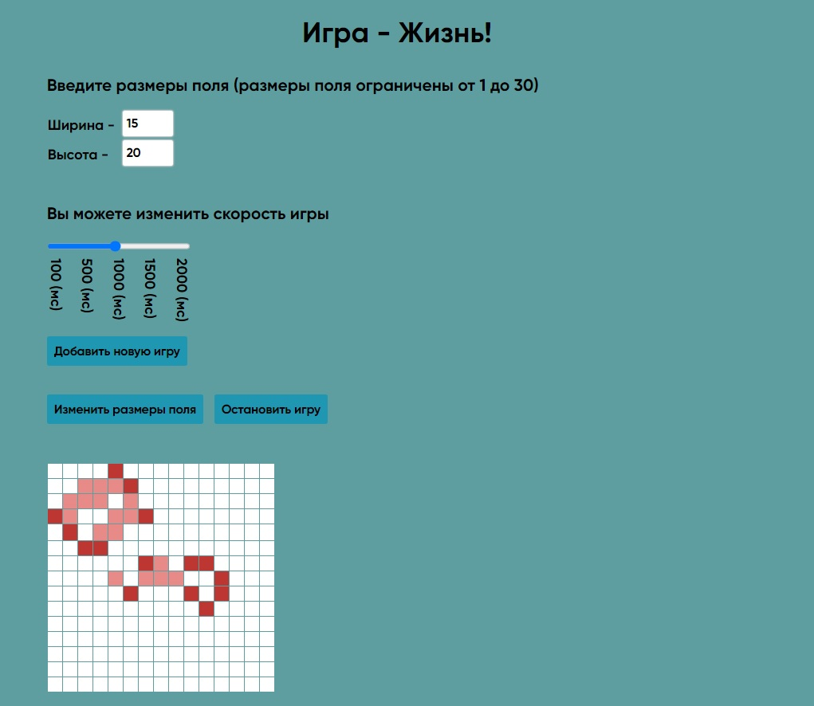
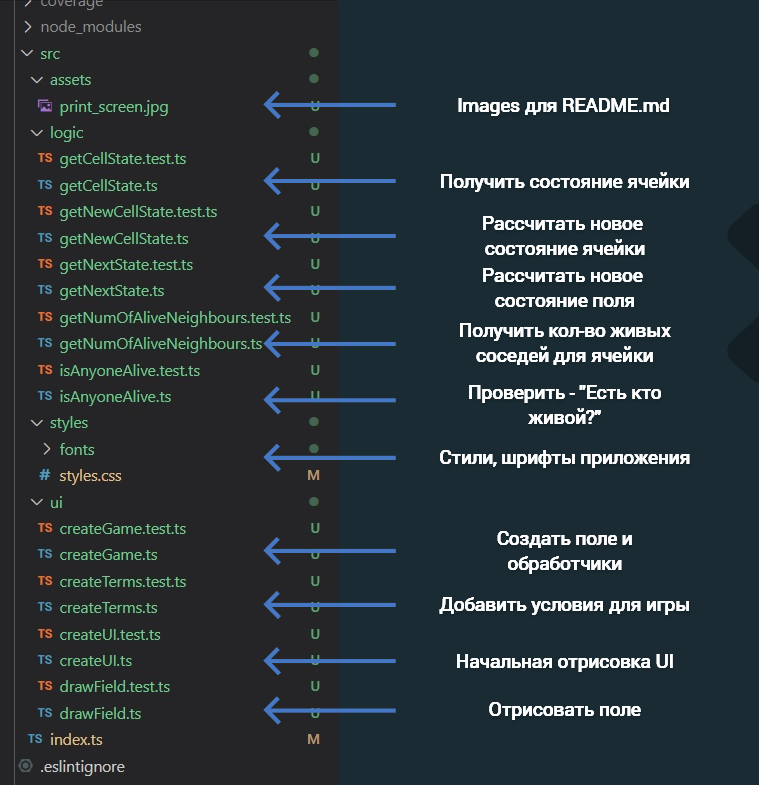

<h1 align="center">Игра "Жизнь"</h1>

_**[Развёрнуто здесь](https://djess-v.github.io/otus--homework--11/)**_

---

<h2>Визуальное представление</h2>

<h2>Описание приложения</h2>

1. При открытии страницы вы увидите настройки для игры "Жизнь".

2. В поле для ввода ширины и высоты поля вы, соответственно, можете задать размеры поля будущей игры (размеры ограничены от 1-ой до 30-ти ячеек). Размер поля можно менять как до запуска игры, так и, непосредственно, во время игры (на лету). Также можете изменить скорость игры в пределах от 100(мс) до 2000(мс). Скорость игры можно менять во время игры.

3. Кнопка "Добавить игру" можно воспользоваться если вам необходимо создать дополнительный экземпляр игры (т.е. ещё одну игру). Сооответственно, кнопка "Удалить данный экземпляр игры" - удалит текущий экземпляр игры.

4. Введите значения в поле ширины и высоты поля -> определитесь со скоростью -> нажмите кнопку "Создать поле". После создания поля вы можете, нажимая на ячейки поля отметить те ячейки, которые будут живыми при старте игры.

5. Определились - "кто жив?" -> нажмите кнопку "Начать игру". Игра запущена! Светло-красный цвет ячеек говорит о том, что в следующем поколении данная ячейка умрёт. Можно дождаться пока игра закончиться, перейдёт в состояние "покоя". Или приостановить игру - нажав кнопку "Остановить игру". Или нажимая на ячейки - изменять состояние ячеек (живая/мёртвая), менять размеры поля, скорость игры.

6. Когда все ячейки умрут - будет выведено соответствующее сообщение. 

<h2>Структура проекта</h2>

